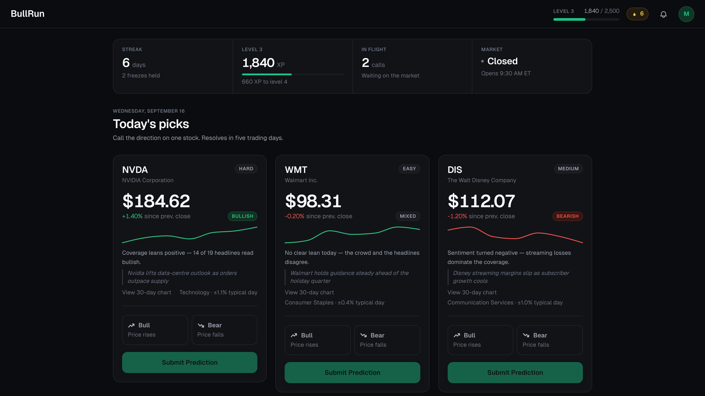
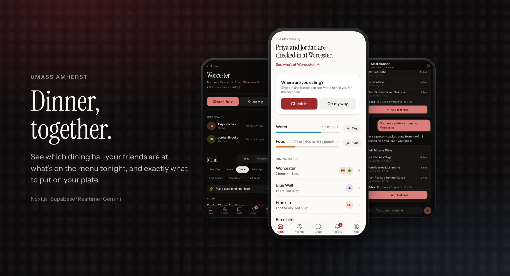

# Mahad Mushtaq

### Software engineer. I ship products, then go looking for the ways they break.

B.S. Computer Science, UMass Amherst · Manning CICS · Chancellor's Award Scholar

**Open to software engineering roles.**

 

 

Two products below. Both are live, both are in use, and both have a written record of
every bug I found on the way — including the ones a passing test suite never noticed.

The source is private while I decide what they become. The case studies are not: they
cover the architecture, the security work, the incidents and the trade-offs in full.

 

---

## BullRun
### A daily market prediction game

 

Most people learn about markets by losing money in them. The loop that teaches you to
invest — form a view, commit to it, find out if you were right — is the same loop that
punishes you for practising. **BullRun keeps the loop and removes the cost.** Three
real stocks a day, one call, five trading days until the market settles it.

A FinBERT pipeline reads news headlines and retail posts for all 37 tickers every
morning. A scheduled job resolves calls against the real close, scores them and pays
out XP. Nobody presses a button to make any of that happen.

<table>
<tr><td><b>Stack</b></td><td>Next.js 14 · TypeScript (strict) · Supabase Postgres · Deno edge functions · FinBERT · Vercel</td></tr>
<tr><td><b>Scale</b></td><td><b>319</b> tests · <b>11k</b> lines · <b>13</b> migrations · <b>37</b> tickers · <b>3</b> unattended cron jobs</td></tr>
<tr><td><b>The part worth reading</b></td><td>Three security holes I found by attacking my own production database — a wide-open authorisation table, a privilege escalation past a header guard, and a policy that could unmask every anonymous player. Each verified exploitable before the fix, and verified closed after.</td></tr>
</table>

**[Read the engineering deck →](https://github.com/mahad1921/bullrun)**  ·  **[Try it live →](https://bullrun-beige.vercel.app)**

 

---

## DineSight
### Live dining for UMass Amherst

 

Seven dining halls, and no idea who's there. DineSight shows where your friends are
eating, what's on the menu tonight, and what to put on your plate — built on UMass
Dining's **undocumented** endpoints, treated as hostile input and never allowed to
block a page.

The AI meal planner never gets the last word on anything factual. The model composes
plates from a pre-filtered menu and returns IDs; the server validates them and
computes every calorie from UMass data. **It cannot invent a dish.**

<table>
<tr><td><b>Stack</b></td><td>Next.js 15 · React 19 · TypeScript · Supabase Postgres · Gemini (structured output) · Playwright · pgTAP</td></tr>
<tr><td><b>Scale</b></td><td><b>416</b> tests — 288 unit, 72 pgTAP against real Postgres, 56 end-to-end · <b>0</b> axe-core violations</td></tr>
<tr><td><b>The part worth reading</b></td><td>Asked <i>"is anything here gluten free?"</i>, the model named a dish UMass lists as containing wheat. Plates were validated; free text wasn't. Grounding the filter in code beat prompting it — conflicting dishes never reach the model, so it cannot name one.</td></tr>
</table>

**[Read the case study →](https://github.com/mahad1921/DineSight)**  ·  **[Try it live →](https://dine-sight.vercel.app)**

 

---

## Experience

**Software Engineering Intern · Sora Labs** — Jun–Aug 2025 
Shipped 10+ full-stack features across React, Next.js, TypeScript and Go/PostgreSQL.
Integrated three generative AI APIs (Fal AI, Gemini 2.5, Kling) for image and video
generation. Built Go services on AWS EC2 and RDS with circuit breakers for fault
tolerance, and automated deployment with GitHub Actions.

**Software Engineering Intern · Edmento** — Dec 2024–Feb 2025 
Built a responsive marketing site and its booking flow end to end.

**Area Supervisor · UMass Residence Hall Security** — 2023–2026 
Promoted from monitor to supervisor; led 20+ staff across 9–10 halls.

 

## How I work

- **Migrations are the schema.** Nothing changes by hand in a dashboard.
- **The database decides, the client only asks.** Row-level security and per-column
  grants, so a forged request fails in the same place a UI bug would.
- **Tests assert what is refused**, not just what works — most of DineSight's 72
  database tests check that something is *denied*.
- **Guards on the guards.** A timezone test asserts the *broken* behaviour still
  reproduces, so the suite fails loudly rather than passing vacuously.
- **A dependency that fails is a screen; one that never finishes is an outage.** I
  learned that from a real one, and wrote it down with the latencies that diagnosed it.
- **The log records the wrong turns too** — the guess that didn't pan out, the claim
  that had to be corrected.

 

## Toolkit

`TypeScript` `JavaScript` `Python` `Go` `Java` `C` `SQL`
`React` `Next.js` `Node.js` `Tailwind` `Zustand`
`PostgreSQL` `Supabase` `Redis` `Prisma` `AWS (EC2, RDS)` `Docker` `GitHub Actions`
`Vitest` `Playwright` `pgTAP` `axe-core` `Jest`
`Gemini` `FinBERT` `FastAPI`

 

---

### Source for both apps is private while I decide what they become.

The decks cover the architecture, the bugs and the trade-offs in full —
and I'm glad to walk through either codebase in an interview.

**[mahadmushtaq21@gmail.com](mailto:mahadmushtaq21@gmail.com)** · **[LinkedIn](https://www.linkedin.com/in/mahad-mushtaq/)**

